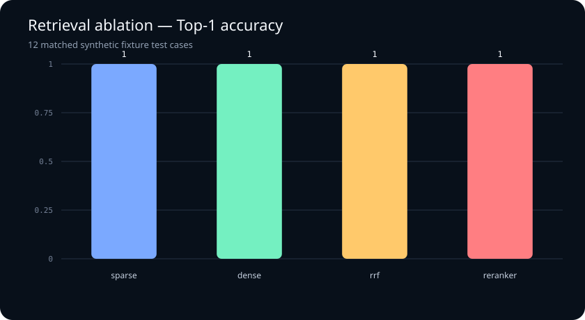
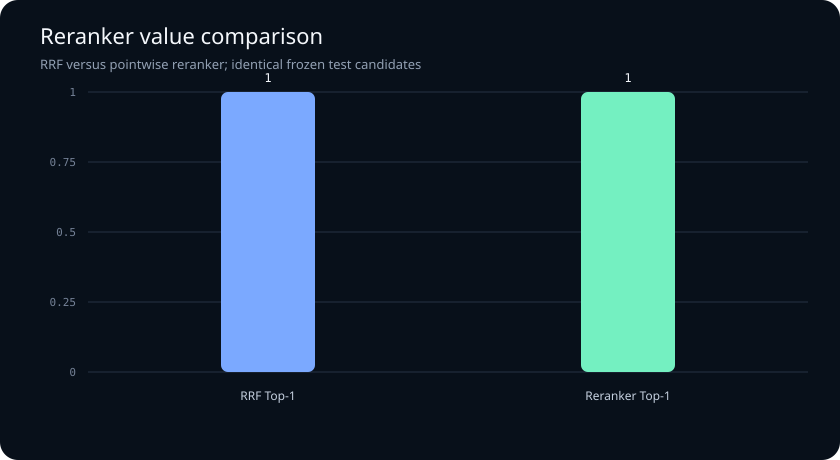
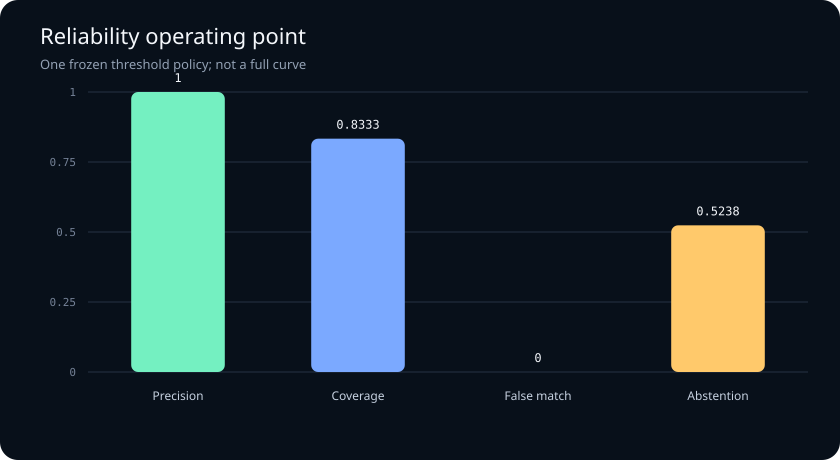
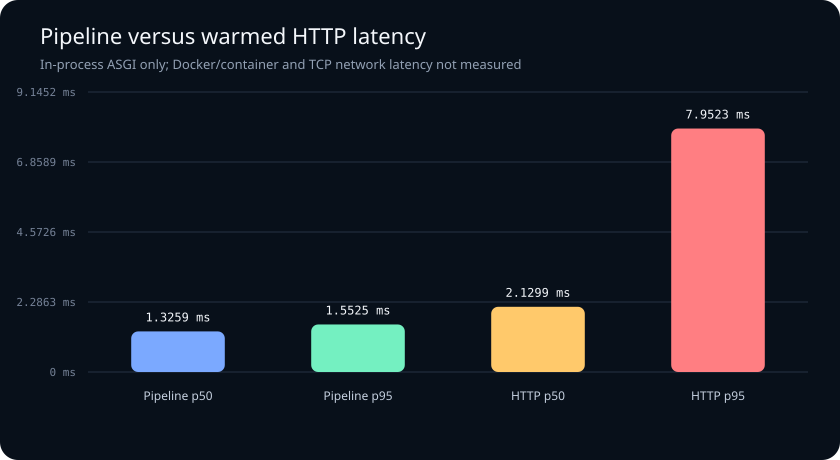

# Product Variant Resolver evaluation — fixture-v1 / test

> **Scope disclosure:** This report covers exactly 21 synthetic fixture test cases. It does not establish production accuracy, marketplace coverage, or production readiness.

## Frozen data and configuration

| Field | Value |
|---|---|
| Test cases | 21 |
| Matched cases | 12 |
| Split strategy | fixed mapping by casting_family; a family occurs in exactly one split |
| Benchmark SHA-256 | `e46c5b4a405a5b3e9fbac35c9613d8e5945e2d4494ad8df9f3d8be1e352fc323` |
| Catalog SHA-256 | `0d3ea55eab414e3845bf3bf72635707210f2d5c20d96b3d6b5940eb0ffc7d261` |
| Candidate K | 25 |
| Dense baseline | `hashing-v1` |
| Default ranker | `rrf` |
| Runtime reranker | `disabled` |
| Ablation-only reranker | `heuristic-v1` |
| Calibrator | `fixture-v1-rrf-logistic-v2` |
| Policy | `fixture-v1-rrf-trained-v2`; `{"margin": 0.08, "match": 0.67, "max_conflicts": 2, "no_match": 0.32}` |

## Headline metrics

Every value below is derivable from `raw_counts` in the adjacent versioned JSON report.

| Metric | Value | Raw derivation |
|---|---:|---|
| Recall@10 | 1 | `retrieved_at_10 / matched_cases` |
| Recall@25 | 1 | `retrieved_at_25 / matched_cases` |
| Recall@50 | 1 | `retrieved_at_50 / matched_cases` |
| Top-1 accuracy | 1 | `correct_top1 / matched_cases` |
| MRR@10 | 1 | `reciprocal_rank_sum_at_10 / matched_cases` |
| Hard-negative accuracy | 1 | `hard_correct / hard_total` |
| Precision | 1 | `correct_matches / predicted_matches` |
| Coverage | 0.8333 | `correct_matches / matched_cases` |
| False-match rate | 0 | `false_matches / nonmatch_cases` |
| Abstention rate | 0.5238 | `(test_cases - predicted_matches) / test_cases` |

## Retrieval and reranking ablation

All stages use the same 12 matched test queries and candidate configuration.

| Stage | Top-1 | Recall@25 | MRR@10 |
|---|---:|---:|---:|
| sparse | 1 | 1 | 1 |
| dense | 1 | 1 | 1 |
| rrf | 1 | 1 | 1 |
| reranker | 1 | 1 | 1 |

Reranking changes Top-1 by **0 absolute** over RRF.

### R11 alternative decision

- Selected default: **rrf**.
- Frozen test evidence: RRF Top-1 1; heuristic-v1 Top-1 1; absolute gain 0.
- Decision: Keep heuristic-v1 out of the default runtime path because it adds zero Top-1 accuracy on the frozen fixture test; retain it only as an opt-in offline ablation.
- External-model boundary: No external cross-encoder was evaluated; this decision makes no claim about one.





## Reliability operating point

This is one frozen policy operating point, not a full precision–coverage curve.



## Latency metadata

The two measurements below are intentionally separate:

| Boundary | p50 | p95 | Samples | Method |
|---|---:|---:|---:|---|
| Internal pipeline | 1.3259 ms | 1.5525 ms | 21 | direct ResolverService wall clock with debug payload construction; sequential warmed process; service startup/index build excluded |
| Warmed HTTP `/resolve` | 2.1299 ms | 7.9523 ms | 21 | sequential warmed POST /resolve requests through in-process TestClient; app construction and warm-up excluded |

- HTTP warm-up requests excluded from samples: 5
- Pipeline warm-up requests excluded from samples: 5
- HTTP smoke includes FastAPI middleware, validation, dispatch, response serialization, and headers.
- HTTP smoke is in-process ASGI; it excludes TCP/network, Docker/container, reverse proxy, and concurrency.
- Container latency measured: **false** — Docker/container, TCP network, reverse-proxy, and concurrent-load latency were not measured by this report.
- Runtime/hardware: Python 3.14.6; `arm64` / `arm`
- Both sets of 21 raw samples are retained in the JSON report.

### R13 local evidence

The warmed in-process HTTP p95 is **7.9523 ms** against the **1500 ms** fixture budget at candidate K=25: **PASS for this limited scope**.
This does not validate Docker/container or real network latency.



## Raw counts

```json
{
  "correct_matches": 10,
  "correct_top1": 12,
  "false_matches": 0,
  "hard_correct": 4,
  "hard_total": 4,
  "matched_cases": 12,
  "nonmatch_cases": 9,
  "predicted_matches": 10,
  "reciprocal_rank_sum_at_10": 12.0,
  "retrieved_at_10": 12,
  "retrieved_at_25": 12,
  "retrieved_at_50": 12,
  "test_cases": 21,
  "wrong_identity_matches": 0
}
```

## Limitations

- The catalog and queries are deterministic synthetic/curated fixtures, not a real marketplace sample.
- The test split contains only 21 cases, including 12 matched cases.
- Latency includes direct-pipeline and in-process HTTP/ASGI smoke measurements; container, database, TCP network, and concurrency costs are excluded.
- These numbers must not be presented as production accuracy or broad Hot Wheels coverage.
